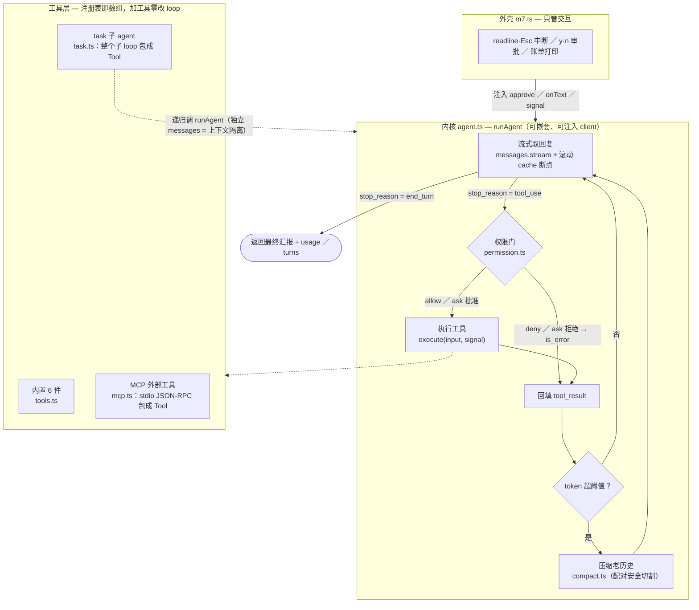

# mini-cc

[](https://github.com/z403529262/mini-cc/actions/workflows/test.yml)

一个最小化的 Claude Code —— 从一个 100 行的 agent loop 出发，增量长出**工具系统、流式中断、上下文压缩、权限审批、MCP、子 agent** 的完整编码 agent 内核。

> 学习项目：从零手写，吃透 agent 的内核。不是又一个 LLM 聊天封装。

## 它是什么

mini-cc 的核心是一个 **agent loop**：模型自己决定调用工具、读取执行结果、规划下一步，循环推进直到任务完成 —— 这正是 Claude Code 这类编码 agent 的内核。

实测：给它一句「列出当前目录最大的 3 个文件，并推测这个项目是干嘛的」，它会自主循环十余轮，依次 `pwd` → `ls` → `find` → `cat` 各文件（甚至读自己的源码），最后准确总结出项目用途。

## 架构



三条设计主线贯穿全部代码：

1. **内核与外壳分离** —— `runAgent` 不碰 readline、不碰 `process.exit`，交互全部参数化成回调（`approve`／`onText`／`signal`）。回报是同一个内核被四次复用：主 agent（m7 壳）、子 agent（task 工具）、批量 eval（D8）、离线测试（fake client 注入）。
2. **工具即注册表** —— 工具 = 给模型看的说明书（`input_schema`）+ 给代码用的执行体（`execute`），加进数组就能用。MCP 外部工具、整个子 agent，都是包装成这个形状后「塞进数组」接入的，loop 与权限门零改动。
3. **一切错误回填** —— 工具失败、未知工具、权限拒绝，都变成 `tool_result`（必要时带 `is_error`）交还模型让它换方案，而不是抛异常崩掉 loop。

## 快速开始

```bash
bun install
export ANTHROPIC_AUTH_TOKEN=<你的 key>     # 见下方 Provider
bun start                                   # 完整版(m7)：全部工具 + MCP + 子 agent
bun run src/m1.ts "列出当前目录最大的 3 个文件，并推测这个项目是干嘛的"   # 或从最小版开始
```

不带参数则跑默认任务。

### Provider

默认接**智谱 GLM** 的 Anthropic 兼容端点（国内直连，无需代理）：

- `baseURL` 指向 `https://open.bigmodel.cn/api/anthropic`
- `apiKey` 读环境变量 `ANTHROPIC_AUTH_TOKEN`
- `MODEL` 为 `glm-4.6`

要换成 Anthropic 官方或其他兼容端点，改各入口文件顶部的 `baseURL` / `MODEL` 即可（`@anthropic-ai/sdk` 对任意 Anthropic 兼容端点通用）。

## 核心：agent loop 就这么点

```ts
const messages = [{ role: "user", content: 任务 }]

while (true) {
  const res = await client.messages.create({ model, system, tools, messages })
  messages.push({ role: "assistant", content: res.content })   // 记住模型这轮的输出
  if (res.stop_reason !== "tool_use") break                    // 不再调工具 → 收工
  const results = res.content.filter(b => b.type === "tool_use")
    .map(b => ({ type: "tool_result", tool_use_id: b.id, content: runBash(b.input.command) }))
  messages.push({ role: "user", content: results })            // 工具结果回填 → 下一轮
}
```

- `tools` 用 JSON Schema 描述工具，模型据此决定**何时**调用、传**什么**参数
- `stop_reason === "tool_use"` → 执行工具、把结果作为 `tool_result` 回填，再循环
- `stop_reason === "end_turn"` → 任务完成，跳出

## 模块地图

| 文件 | 职责 | 看点 |
|---|---|---|
| `src/m0.ts` … `src/m7.ts` | 八个里程碑入口，每个可独立运行 | 增量演进：diff 相邻两个就是那一步的全部改动 |
| `src/agent.ts` | **runAgent 内核**：流式 → 权限门 → 执行 → 回填 → 压缩 → 循环 | 可嵌套、可注入 client；`maxTurns` 熔断 |
| `src/tools.ts` | 内置 6 工具：read / write / edit / glob / grep / bash | `edit_file` 唯一性契约；bash 进程组击杀（可中断） |
| `src/permission.ts` | 权限门：allow / ask / deny 三态 | 判「工具+参数」而非工具名；拿不准一律 ask |
| `src/compact.ts` | 上下文压缩 | 切割点绝不劈开 tool_use/tool_result 配对（劈开 = API 400） |
| `src/mcp.ts` | 手写 stdio JSON-RPC 的 MCP 客户端 | 外部工具包装成本地 `Tool` 形状，loop 零改动接入 |
| `src/task.ts` | 子 agent 包装成 `task` 工具 | 上下文隔离、只读子集、递归防护 |

## 里程碑

- [x] **M0** 单轮问答 — `src/m0.ts`
- [x] **M1** agent loop + bash 工具 — `src/m1.ts`
- [x] **M2** 多工具：read / write / edit / glob / grep — `src/tools.ts` + `src/m2.ts`
- [x] **M3** 流式输出 + 可中断（Esc）— `src/m3.ts`（execute 异步化见 `src/tools.ts`；中断验证 `demo/abort-check.ts`）
- [x] **M4** 上下文压缩 + prompt caching — `src/m4.ts`（caching：SYSTEM 断点 + `withRollingCache`）+ `src/compact.ts`（配对安全压缩）；验证 `demo/compact-check.ts`
- [x] **M5** 工具权限审批（危险命令拦截）— `src/permission.ts`（三态 allow/ask/deny）+ `src/m5.ts`（execute 前权限门）；验证 `demo/permission-check.ts` + `demo/permission-flow-check.ts`
- [x] **M6** MCP 客户端（接外部工具）— `src/mcp.ts`（手写 stdio JSON-RPC，把 MCP 工具包装成本地 `Tool`）+ `src/m6.ts`（连接后并入 `toolMap`，loop/权限门零改动）；最小 server `demo/mcp-server-calc.ts`，验证 `demo/mcp-check.ts`
- [x] **M7** 子 agent（隔离上下文的 Task）— `src/agent.ts`（把 m0-m6 的 inline loop 抽成可复用、可嵌套、可注入 client 的 `runAgent` 内核，主 / 子 agent 共用）+ `src/task.ts`（`makeTaskTool` 把「带独立上下文的子 loop」包成一个只读、防递归的 `Tool`）+ `src/m7.ts`（壳：连 MCP + 接 task + 把中断 / 审批当回调注入 `runAgent`）；验证 `demo/task-check.ts`

> **延伸（LLM 应用层，非内核里程碑）**
> - **D8 评估与可观测** — `demo/eval.ts` + `demo/eval-tasks.ts`：给 agent 固定任务集 + 判据，批量跑统计通过率 / 轮数 / token（程序化断言 + LLM-judge）
> - **D9 RAG 与检索** — `demo/rag-mini.ts`：手写最小 RAG（chunk → TF-IDF → 余弦 top-k → 生成）+ agentic search 对照；另有 `demo/structured-output.ts`（强制 schema）与 `demo/retry-fallback.ts`（指数退避 + 模型降级）

## 测试

```bash
bun test            # 全离线，~0.4s，无需 API key
bun run typecheck   # tsc --noEmit
```

测试策略 = 测**协议层 + 逻辑层**，不测 LLM 输出本身（那是非确定的，归 `demo/eval.ts` 的 eval 管，见 D8 笔记）：

- **fake client 注入** — `runAgent` 的 client 是参数，测试把「模型会怎么回」写成脚本注入，专门验证 loop 拿到各种回复后的行为：执行、回填、未知工具、权限拦截、`maxTurns` 熔断、中断
- **真文件系统 + 真子进程** — 工具测试不 mock fs（工具的价值就在与真实世界交互的边界处理）；MCP 测试起一个真 server 子进程，走完 stdio JSON-RPC 握手 / 发现 / 调用 / 错误二分 / 关闭全流程
- **压缩的核心不变量** — 对任意切割参数，保留段内每个 `tool_result` 的配对 `tool_use` 必须也在保留段内（劈开配对 = API 400）

CI（GitHub Actions）在每次 push / PR 上跑 typecheck + 全量测试，零 secrets。

## 学习笔记（docs/）

按天沉淀的深挖笔记，每篇 = what/why 讲透 + 解剖真实 Claude Code 实现对照 + 面试金句：

| 笔记 | 主题一句话 |
|---|---|
| [D1 深度问答](docs/D1-深度问答笔记.md) | agent loop 是个 `stop_reason` 状态机；tool_result 配对规则 |
| [D2 工具系统](docs/D2-工具系统与文件编辑对照.md) | 工具 = 说明书 + 执行体；`edit_file` 唯一性契约为何比 sed 可靠 |
| [D3 流式与中断](docs/D3-流式输出与可中断对照.md) | SSE 流式；Esc 中断要杀整个进程组，否则孤儿进程拖死管道 |
| [D4 压缩与缓存](docs/D4-上下文压缩与缓存对照.md) | context 满了怎么办；prompt caching 的前缀命中模型 |
| [D5 权限审批](docs/D5-工具权限审批对照.md) | allow/ask/deny；正则不是真安全，拿不准交给人 |
| [D6 MCP](docs/D6-MCP客户端对照.md) | 手写 stdio JSON-RPC；MCP vs function calling |
| [D7 子 agent](docs/D7-子agent对照.md) | 上下文隔离的本质；递归防护那半个条件 |
| [D8 评估与可观测](docs/D8-评估与可观测对照.md) | 怎么衡量 agent 好不好；程序化断言 vs LLM-judge |
| [D9 RAG 与检索](docs/D9-RAG与检索对照.md) | 最小 RAG 六步；为什么 Claude Code 不挂向量库 |
| [D9 附录 生产级 RAG](docs/D9-附录-生产级RAG深读.md) | 解剖 Anthropic Contextual Retrieval 源码；批判性读 benchmark |
| [D10 作品打磨](docs/D10-作品打磨.md) | 测试策略取舍；5 分钟走读这个 repo 的路线 |
| [D11 面试题答题骨架](docs/D11-面试题答题骨架.md) | 十道高频题 + 压轴设计题，三段式：30 秒版 / 展开版 / 追问防守 |

## 技术栈

Bun · TypeScript · [@anthropic-ai/sdk](https://github.com/anthropics/anthropic-sdk-typescript)

## License

MIT
